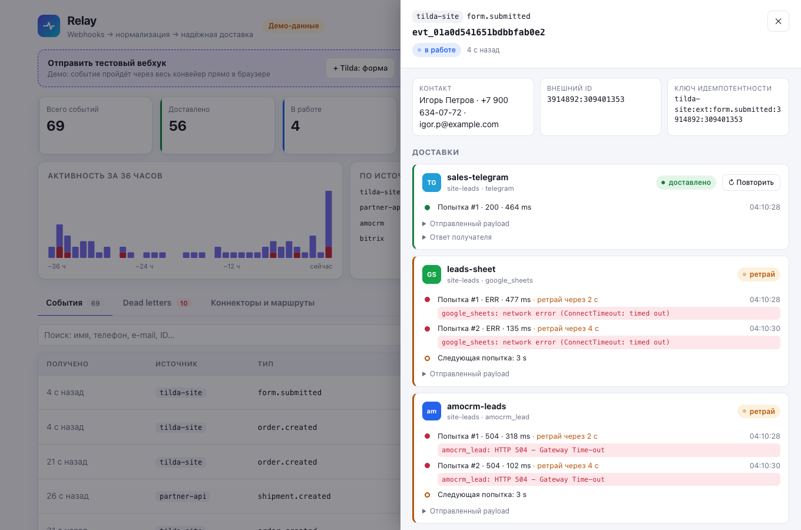

# Relay

[Русский](README.md) · **English**

Relay receives webhooks and fans them out to destinations. A source can be Tilda, amoCRM, Bitrix24 or any system that signs its JSON with an `X-Relay-Signature` header (HMAC-SHA256); destinations are Telegram, Google Sheets, amoCRM, email and outgoing webhooks. Each delivery runs as a separate job with its own retries, and anything that never gets through waits in dead letters along with its attempt history. The backend is FastAPI and httpx, events are stored in SQLite, the queue lives in Redis or in process memory, and routes and field mapping are in YAML; the dashboard is React 19 and TypeScript.

Demo: https://sinnercode228.github.io/integration-hub/ — dashboard only, there's no backend on Pages. Events and failures there come from a separate TypeScript simulation running right in the browser ([`engine.ts`](dashboard/src/api/mock/engine.ts)), with generated data. Failures in the simulation are scripted, pauses between attempts have no jitter, and a replay always succeeds. The easiest thing to try is the "+ Tilda: form" button on the "Send a test webhook" panel ("+ Tilda: форма" in the Russian UI): the new event appears at the top of the list, and clicking it opens its deliveries to Telegram, Sheets and amoCRM. The dashboard refetches the open event every 2 s, so new attempts show up in it on their own. For events from this button, the script fails about 30% of deliveries, so two or three clicks usually get you both a failure and a retry, as in the screenshot below.



## A Tilda lead, step by step

The `site-leads` route in [`config/relay.yaml`](config/relay.yaml) sends every form from the website to the sales chat in Telegram, as a row to Google Sheets and as a deal to amoCRM. Let's follow a lead that arrives while Telegram is answering `429` and amoCRM is timing out.

1. `POST /webhooks/tilda-site` compares the Tilda API key using `hmac.compare_digest` and removes it from the data before saving, parses the form and builds the idempotency key from `tranid`. The event and three deliveries are written to SQLite in one transaction, three jobs go into the queue, and Tilda gets a `202`. It has to respond right away: amoCRM, for example, disables a webhook after a series of slow or failed responses (see the comment in [`connectors/inbound/amocrm.py`](backend/src/relay/connectors/inbound/amocrm.py)), so deliveries are handled by a background worker.
2. Each delivery is a separate job, and the worker processes them independently. Sheets answered `200`, so that delivery is done.
3. Telegram returned `429` with `parameters.retry_after` in the response body. The connector passes that number to the worker, and the next attempt is scheduled no earlier than Telegram asks. In the [test](backend/tests/test_pipeline.py), `retry_after: 40` gives a delay of 40 s instead of the base 2.
4. The amoCRM request timed out: httpx waits up to 10 s for each phase of the request, and `asyncio.wait_for` cuts off the whole attempt at 20 s. That's a transient error, so it's retried after about 2 s, then after 4, 8 and so on. `amocrm-leads` has `max_attempts: 12` in the config, which is about an hour of waiting; the default is 8 attempts, about 4 minutes.
5. When the attempts run out, the delivery gets the status `dead` and the event gets `partial`. You can send it again from the dashboard or with `POST /admin/api/deliveries/{id}/replay`: the delivery goes back to `pending`, the old attempts stay in the history, `attempt_base` records how many there were, and the attempt budget starts over.

Tilda, amoCRM and Bitrix24 send a static secret: Tilda sends an API key as a request field, amoCRM a token in the URL, and Bitrix24 an `application_token`. Only the generic source has a signature, with a 300 s window and multiple `v1=` values for secret rotation ([`security.py`](backend/src/relay/security.py)). The only source that makes a network request right in the handler is Bitrix24 with `rest_webhook_url` configured: the event is enriched via `crm.<entity>.get`, with a 5 s timeout.

## A sorted-set queue with leases

[`queue/redis.py`](backend/src/relay/queue/redis.py) keeps three keys:

```
relay:q:scheduled   ZSET  job -> earliest time it can be picked up
relay:q:inflight    ZSET  job -> lease deadline
relay:q:dead        HASH  delivery_id -> {job, reason, at}
```

I built the queue on sorted sets because a delayed retry is then just a `ZADD` with a future score, and there's no need for a separate delay queue. Enqueuing the same job again only moves its time. Under `docker compose`, Redis writes an AOF (`--appendonly yes`).

The worker picks ready jobs with `ZRANGEBYSCORE` and for each one runs `MULTI { ZREM scheduled; ZADD inflight }` with a 120 s lease. A job is processed only by the worker whose `ZREM` actually removed it, so with several `relay worker` processes on one Redis, no two of them grab the same job. By default `asyncio.wait_for` cuts an attempt off at 20 s, so the lease doesn't expire mid-request.

Before each pass, `requeue_expired` moves jobs with an expired lease from `inflight` back to `scheduled` with `ZADD NX`. If processing raised an exception or the process died, the job stays in `inflight` until the lease runs out, and then it's picked up again (at-least-once). In [`worker.py`](backend/src/relay/worker.py), the result of an attempt is saved first, then the retry is put into `scheduled`, and only then comes the `ack`. If the process dies between `enqueue` and `ack`, the job ends up in both sets, and `ZADD NX` on requeue won't overwrite the delay that's already been scheduled. With the order reversed, a job in that window would vanish from both sets.

## Where the idempotency key comes from

CRMs and site builders resend webhooks on timeouts, so duplicates are normal traffic. [`derive_key`](backend/src/relay/idempotency.py) takes the first one available:

1. the `Idempotency-Key` header, if the sender provided one;
2. the external id from the source system itself: `entity:id:action:last_modified` for amoCRM, `event:id:ts` for Bitrix24, `tranid` for Tilda (or the order's `orderid` if there's no `tranid`), a configurable field for the generic source;
3. a SHA-256 of the request body.

Because of `last_modified`, the next edit to the same amoCRM deal gets a new key and goes through as a new event. amoCRM can pack several entities into one request, and each one becomes a separate event; keys from the header and the body then get `:index` appended.

With Redis, the key is claimed with `SET NX EX` for 7 days, and the value is the new event's id; without Redis it's a dict in process memory with the same TTL, and it's empty after a restart. If writing the event to storage fails, the key is released; otherwise a resend from the source would also count as a duplicate. If the key expires between `SET` and `GET`, the claim is retried. A repeat with a key that's already taken, such as the same webhook from Tilda, gets `200` and the id of the earlier event in `duplicates`.

## Transient or permanent error

The general rule for which errors are transient lives in one place, [`connectors/http.py`](backend/src/relay/connectors/http.py): 408, 409, 425, 429, any 5xx, network errors and timeouts are retried, and every other 4xx goes straight to dead letters. A template error is permanent too. Connectors refine the rule where an API has its own quirks:

| Destination | Retried | Straight to dead letters |
|---|---|---|
| Telegram | 429 (delay from `parameters.retry_after`), 5xx | other 4xx: 400 chat not found, 403 bot blocked |
| Google Sheets | 401: with a service account, the cached token is dropped and the next attempt issues a new one; with a static `access_token`, retries go out with the same one | general rule |
| amoCRM | general rule | 401 (the token is static, no OAuth refresh) |
| SMTP | codes < 500, connection errors | codes ≥ 500, all recipients rejected |

For a service account, Relay issues the Google token itself, without the Google SDK (an RS256 JWT via PyJWT), and keeps it cached until 60 s are left before it expires ([`google_sheets.py`](backend/src/relay/connectors/outbound/google_sheets.py)).

The delay comes from [`RetryPolicy`](backend/src/relay/worker.py): `min(3600, 2·2^(n−1))` seconds, then multiplied by `1 − 0.2·random()`. That way jitter only shortens the pause and never pushes it past the cap. If the destination sent `Retry-After` (seconds or an HTTP date), Relay uses `max(delay, min(retry_after, 3600))`. `max_attempts` and `timeout_seconds` are set per destination.

Error text goes into the attempt history only after `redact`: the worker cuts the connector's secrets out of it (Telegram has the bot token right in the URL). The test from step 3 also checks that the Sheets token in the `ConnectError` text doesn't reach `last_error`.

## Routes in YAML and my own template language

The mapping rules in [`config/relay.yaml`](config/relay.yaml) are the `routes` block: `match` selects events by source, type and `where` conditions, and `deliver` lists the destinations with a template for each. Here's a piece of the real config (the message text is in Russian):

```yaml
routes:
  - name: site-leads
    match:
      source: tilda-site
      type: form.submitted
    deliver:
      - to: sales-telegram
        template:
          text: |-
            <b>Новая заявка с сайта</b>
            Форма: {{ fields.form_name | default('без названия') }}
            Имя: {{ contact.name | default('—') }}
            Телефон: {{ contact.phone | phone | default('—') }}
            Комментарий: {{ fields.comment | default('—') | truncate(300) }}
            UTM: {{ fields.utm.utm_source | default('direct') }}
      # ... leads-sheet, amocrm-leads
```

I wrote my own template language instead of using Jinja; the parser is in [`templating.py`](backend/src/relay/templating.py). Filter arguments are parsed only with `ast.literal_eval`, so `{{ x | default(__import__('os')) }}` is a template error (`test_errors_and_no_code_execution` in [`test_core.py`](backend/tests/test_core.py)). There are 14 filters: `phone` (normalizes to E.164), `date`, `default`, `int`, `truncate`, `json` and others. A string that's a single expression keeps its type: `"{{ fields.price | int }}"` becomes a number.

Escaping is set per destination field. For Telegram, the `text` field is sent with `parse_mode=HTML`: substituted values go through `html.escape`, the template's own tags stay as they are, and the name `Анна <b>` arrives in the chat as `Анна &lt;b&gt;`. For SMTP, the `html` field is escaped the same way.

## Stock levels from MoySklad

Separately from webhooks, there's `GET /api/stock?sku=…` for a stock widget on the storefront ([`connectors/moysklad.py`](backend/src/relay/connectors/moysklad.py)): the MoySklad access token stays on the server, and the browser only gets the SKU, quantity and status. Results are cached for 60 s; concurrent misses wait on a single `asyncio.Lock` and then re-check the cache, so a burst of requests from a product page turns into one request to MoySklad. If MoySklad doesn't respond, values up to 900 seconds old are served, marked `stale: true`; SKUs go into the request filter in batches of 25.

## Where an event can get lost or duplicated

- Intake isn't transactional: the idempotency key, the event in SQLite and the jobs in the queue are written in separate steps, and nothing reconciles SQLite with the queue. If the process dies between steps, the deliveries stay in `pending` with no job, a resend of the same webhook gets `200 duplicate`, and a manual replay of an unfinished delivery returns `409`.
- Without Redis the queue lives in memory: restarting `relay serve` loses the scheduled retries, and the deliveries stay `pending`/`retrying`.
- Delivery is at-least-once. If the destination accepted the request but the response got lost, Relay sends it again: a second message in the chat, a second row in the sheet, a second deal in amoCRM. Only an outgoing webhook's receiver can filter out the duplicate: it gets an `Idempotency-Key` with the delivery id, the same on every attempt.
- In amoCRM, the deal and the note go out as two requests. I don't retry an HTTP error on the note; I write it to `note_error` instead, because a retry would create a second deal. But a network error on that request bypasses `send_request`, so the worker treats it as unexpected and retries the whole delivery.

## Running it

Without Docker or Redis, with the queue and idempotency keys in process memory and SQLite in `data/relay.db` (you need Python 3.12+):

```bash
python3 -m venv .venv && . .venv/bin/activate
pip install -e "backend[dev]"
relay check-config        # validates config/relay.yaml and connector options
relay serve               # API + worker in one process, http://127.0.0.1:8000/docs
# in a second terminal, with .venv activated (the script needs relay sign):
examples/send.sh          # Tilda, amoCRM, Bitrix24 and HMAC webhooks, plus one duplicate
```

Dashboard:

```bash
cd dashboard && npm ci
npm run dev                       # the same simulation as on Pages, http://localhost:5173
VITE_API_MODE=live npm run dev    # live API, /admin/api is proxied to :8000
```

`docker compose up --build` starts the API, a separate worker and Redis; the dashboard is then at http://localhost:8000/admin/. The API and the worker share the SQLite file through the `relay-data` volume, so you can't split them across machines. `/metrics` on the same port is open without auth.

Without a `.env`, Relay uses the dev values from `relay.yaml`, written as `${VAR:-dev-value}`. Real secrets go into `.env`, following [`.env.example`](.env.example), and you should only keep the lines you've filled in: an empty `TILDA_API_KEY=` overrides the dev value, and `relay check-config` fails on the source with no secret. Process settings are the `RELAY_*` variables from [`settings.py`](backend/src/relay/settings.py). With `RELAY_ENV=prod`, the service refuses to start while any source still has a secret with the `dev-` prefix, and the admin API returns `503` without `RELAY_ADMIN_TOKEN`; in dev, the admin API is open without a token, with only a warning in the log. CLI commands: `relay serve | worker | check-config | sign`; `sign` computes `X-Relay-Signature` for the generic source.

## Tests

```bash
cd backend && pytest --cov=relay               # 140 tests, 92% coverage (coverage.py, branch = true)
ruff check src tests && mypy                   # mypy in --strict mode
cd ../dashboard && npm run lint && npm test    # ESLint + tsc, 15 Vitest tests
```

In the tests, the network is mocked with respx and Redis with fakeredis. The queue and idempotency run through the same contract tests against memory and fakeredis, and storage against memory and SQLite ([`tests/test_infra.py`](backend/tests/test_infra.py)). CI runs the backend on Python 3.12, 3.13 and 3.14 and builds the dashboard and the Docker image.

More screenshots: [dead letters](docs/screenshots/dead-letters.png), [connectors and routes](docs/screenshots/connectors.png), [phone, dark theme](docs/screenshots/mobile.png).

---

Built by Грешный Котик (sinnercode). I take freelance work like this: Telegram [@sinnercode](https://t.me/sinnercode). License: [MIT](LICENSE).
