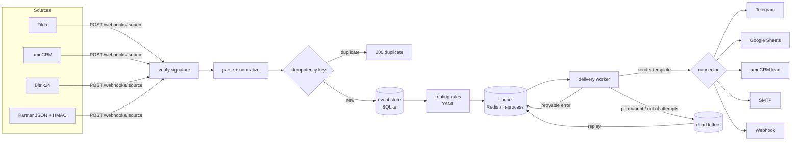
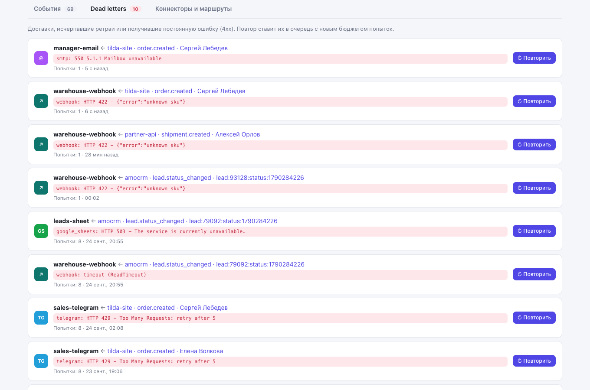
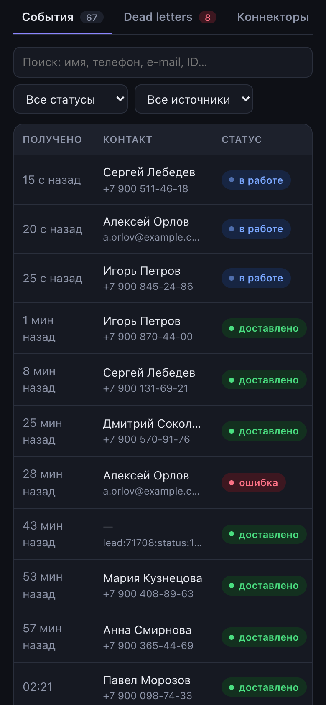

# Relay — integration hub

[](https://github.com/sinnercode228/integration-hub/actions/workflows/ci.yml)
[](https://sinnercode228.github.io/integration-hub/)


**Live demo:** https://sinnercode228.github.io/integration-hub/ — the admin dashboard running on mock events in your browser, no backend needed.

> Демо-проект / Demo project. «Relay» — вымышленный бренд; все люди, заказы и компании в демо-данных вымышлены.
>
> Tilda, amoCRM, Bitrix24, Telegram, Google Sheets и МойСклад — сторонние сервисы, с которыми Relay интегрируется через их публичные API; проект с ними не связан. / These are third-party services Relay integrates with via their public APIs; the project is not affiliated with them.

[Русский](#русский) · [English](#english)


---

## Русский

**Relay** — сервис интеграций для бизнеса: принимает вебхуки из Tilda, amoCRM, Bitrix24 и любых систем с HMAC-подписью, приводит их к единому формату и **надёжно** доставляет в Telegram, Google Sheets, amoCRM, почту и внешние вебхуки. Ретраи с экспоненциальной задержкой, dead-letter очередь, повтор доставки в один клик, метрики Prometheus и админ-панель.

### Какую проблему решает

Типичная связка «форма на сайте → CRM → чат → таблица» обычно собирается из разрозненных скриптов или no-code сервисов. Ломается она тихо: Telegram ответил 429, токен amoCRM истёк, склад на обслуживании — и заявка потерялась. Relay делает этот поток наблюдаемым и отказоустойчивым:

- **каждое событие сохраняется** до доставки, у каждой доставки видна история попыток и ошибок;
- **временные ошибки** (5xx, 429, таймауты) повторяются с backoff и учётом `Retry-After`, **постоянные** (4xx, битый шаблон) сразу уходят в dead-letter;
- **дубли** (CRM и конструкторы сайтов повторяют вебхуки) отсекаются ключами идемпотентности;
- **маршруты и маппинг** описываются в YAML, без правки кода.

### Возможности

| | |
|---|---|
| **Входящие коннекторы** | Tilda (формы и заказы корзины, ping `test=test`, UTM из cookies), amoCRM (form-urlencoded в PHP-нотации, несколько сущностей в одном запросе), Bitrix24 (`application_token`, обогащение через `crm.*.get`), Generic JSON с HMAC-SHA256 |
| **Исходящие коннекторы** | Telegram Bot API (HTML-экранирование данных пользователя), Google Sheets (service account JWT без Google SDK), amoCRM (`leads/complex`: сделка + контакт + примечание), SMTP (aiosmtplib), generic webhook (подпись + `Idempotency-Key`) |
| **Безопасность** | проверка подписи/токена в constant time, окно по времени против replay-атак, ротация секретов (несколько `v1=`), секреты только из env (в `prod` сервис не стартует с плейсхолдерами `dev-*`), вырезание токенов из ошибок и логов |
| **Надёжность** | очередь с lease (at-least-once), backoff `2s·2ⁿ` + jitter, `Retry-After`, dead-letter, replay с новым бюджетом попыток, Redis или in-process очередь |
| **Маппинг** | безопасный мини-язык шаблонов `{{ contact.phone \| phone }}`: 14 фильтров, аргументы только литералы (`ast.literal_eval`), сохранение типов |
| **МойСклад** | прокси остатков `GET /api/stock?sku=…` для витрины: TTL-кэш, single-flight, stale-if-error, CORS; токен никогда не попадает в браузер |
| **Наблюдаемость** | структурные JSON-логи (structlog) с `request_id`, `/metrics` для Prometheus, `/healthz`, `/readyz`, админ-API и дашборд |

### Архитектура



HTTP-обработчик выполняет только быстрый путь (проверка → нормализация → запись → постановка в очередь) и сразу отвечает `202`, поэтому amoCRM и Bitrix24 не отключают вебхук из-за медленных ответов. Доставки делает воркер — в том же процессе (`relay serve`) или отдельным сервисом (`relay worker`) при общей очереди в Redis.

```
backend/src/relay/
├── api/            FastAPI: webhooks, admin API, stock proxy, ops (health, metrics)
├── connectors/     плагины: inbound/*, outbound/*, moysklad.py, реестр @inbound/@outbound
├── queue/          протокол очереди + in-memory и Redis реализации
├── store/          протокол хранилища + in-memory и SQLite (WAL) реализации
├── ingest.py       verify → normalize → dedupe → store → route → enqueue
├── worker.py       ретраи, backoff, dead-letter, replay
├── templating.py   безопасный язык шаблонов маппинга
├── routing.py      условия маршрутов (eq, in, contains, regex, gt, …)
└── container.py    composition root (тот же код в тестах и в проде)
dashboard/          React + TypeScript SPA; src/api/mock — симуляция конвейера для демо
config/relay.yaml   источники, получатели, маршруты, шаблоны
```

### Конфигурация маршрутов

```yaml
routes:
  - name: crm-won-deals
    match:
      source: amocrm
      type: lead.status_changed
      where:
        - { path: fields.status_id, op: eq, value: 142 }   # «Успешно реализовано»
    deliver:
      - to: leads-sheet
        template:
          values: ["{{ received_at | date }}", "{{ fields.name }}", "{{ fields.price | int }}"]
      - to: warehouse-webhook          # без шаблона — шаблон коннектора по умолчанию
```

Секреты задаются только через `${ENV_VAR}` / `${ENV_VAR:-default}`; полный список — в [`.env.example`](.env.example). Проверка конфига: `relay check-config`.

### Запуск

**Локально (без Docker и Redis):**

```bash
python3 -m venv .venv && . .venv/bin/activate
pip install -e "backend[dev]"
relay check-config                    # валидация config/relay.yaml
relay serve                           # API + воркер: http://127.0.0.1:8000/docs
examples/send.sh                      # отправить тестовые вебхуки (Tilda, amoCRM, Bitrix24, HMAC)
```

**Дашборд:**

```bash
cd dashboard && npm ci
npm run dev                           # демо-режим на mock-данных: http://localhost:5173
VITE_API_MODE=live npm run dev        # живой API (прокси /admin/api -> :8000)
```

Собранный дашборд можно отдать самим API: `npm run build:admin`, затем `RELAY_DASHBOARD_DIR=dashboard/dist relay serve` → http://127.0.0.1:8000/admin/ (в Docker это уже настроено).

Режим выбирается при сборке (`VITE_API_MODE=mock|live`, `VITE_API_BASE`) или параметром `?api=live` в URL. В live-режиме в шапке появляется поле для admin-токена (`RELAY_ADMIN_TOKEN`).

**Docker Compose (API + отдельный воркер + Redis):**

```bash
cp .env.example .env                  # заполнить токены
docker compose up --build             # http://localhost:8000/admin/
```

### Тесты и качество

```bash
cd backend && pytest --cov=relay       # 140 тестов, покрытие ~92%, без сети и без Docker
ruff check src tests && mypy           # линтер + mypy --strict
cd ../dashboard && npm run lint && npm test   # ESLint + tsc, 15 тестов (Vitest)
```

Внешние API замоканы через **respx** (httpx), Redis — через **fakeredis**; очередь, идемпотентность и хранилище прогоняются одним контрактным набором тестов для каждой реализации. CI (`.github/workflows/ci.yml`): линт, типы, тесты на Python 3.12–3.14, сборка дашборда и Docker-образа.

### Демо на GitHub Pages

`.github/workflows/pages.yml` собирает дашборд с `BASE_PATH=/<repo>/` и `VITE_API_MODE=mock` и публикует через `actions/deploy-pages` (Settings → Pages → Source: **GitHub Actions**). В демо конвейер симулируется в браузере: кнопки «Отправить тестовый вебхук» создают события, которые проходят маршрутизацию, ретраи и dead-letter с той же логикой, что и бэкенд.

| Детали события | Dead letters | Телефон, тёмная тема |
|---|---|---|
|  |  |  |

---

## English

**Relay** is a business integration service: it receives webhooks from Tilda, amoCRM, Bitrix24 and any HMAC-signing system, normalizes them into one event format and **reliably** delivers them to Telegram, Google Sheets, amoCRM, e-mail and outbound webhooks — with exponential-backoff retries, a dead-letter queue, one-click replay, Prometheus metrics and an admin dashboard.

### Why

"Site form → CRM → chat → spreadsheet" glue usually lives in ad-hoc scripts and fails silently: Telegram answers 429, the amoCRM token expires, the warehouse API is in maintenance — and a lead is lost. Relay makes the flow observable and fault-tolerant:

- every event is **persisted before delivery**; each delivery keeps its full attempt history;
- **transient errors** (5xx, 429, timeouts) are retried with backoff honouring `Retry-After`; **permanent** ones (4xx, broken template) go straight to the dead-letter queue;
- **duplicates** (CRMs and site builders retry webhooks) are dropped via idempotency keys;
- **routes and field mapping** live in YAML — no code changes to add a flow.

### Features

- **Inbound:** Tilda (forms, cart orders, `test=test` ping, UTM from cookies), amoCRM (PHP-bracket form bodies, many entities per request), Bitrix24 (`application_token`, optional enrichment via `crm.*.get`), generic JSON signed with HMAC-SHA256 (`X-Relay-Signature: t=…,v1=…`).
- **Outbound:** Telegram (user data HTML-escaped, `retry_after` honoured), Google Sheets (service-account JWT flow with PyJWT, token cache), amoCRM `leads/complex` (lead + contact + note, no duplicate leads on retry), SMTP (4xx → retry, 5xx → dead), generic webhook (signed, `Idempotency-Key: <delivery id>`).
- **Security:** constant-time signature/token checks, timestamp tolerance against replays, secret rotation, env-only secrets, secrets scrubbed from errors and logs, admin API behind a Bearer token (mandatory in `prod`); `prod` also refuses to start with the `dev-*` placeholder secrets from `relay.yaml`.
- **Reliability:** leased queue (at-least-once, crash-safe), `2s × 2ⁿ` backoff with jitter, per-destination `max_attempts`/`timeout_seconds`, dead letters, replay with a fresh attempt budget; Redis for multi-process, in-process fallback for single-node/dev.
- **Mapping language:** `{{ path | filter(args) }}` with 14 filters (`phone`, `date`, `default`, `int`, `truncate`, `json`…), literal-only arguments (never executes code), type-preserving single expressions.
- **MoySklad stock proxy:** `GET /api/stock?sku=…` for storefront widgets with TTL cache, single-flight coalescing, stale-if-error and CORS allow-list — the token never reaches the browser.
- **Observability:** structlog JSON logs with request ids, Prometheus `/metrics`, `/healthz`, `/readyz`, admin API (`/admin/api/events`, `/stats`, `/dead-letters`, `…/replay`, `/connectors`) and the React dashboard.

### Run

```bash
python3 -m venv .venv && . .venv/bin/activate
pip install -e "backend[dev]"
relay serve                  # API + in-process worker, OpenAPI at http://127.0.0.1:8000/docs
examples/send.sh             # fire sample Tilda / amoCRM / Bitrix24 / HMAC webhooks

cd dashboard && npm ci && npm run dev          # demo mode (mock data)
VITE_API_MODE=live npm run dev                 # against the local API

docker compose up --build    # API + dedicated worker + Redis, dashboard at /admin/

# serve the built dashboard from the API without Docker
(cd dashboard && npm run build:admin) && RELAY_DASHBOARD_DIR=dashboard/dist relay serve
```

CLI: `relay serve | worker | check-config | sign --secret … --file body.json`.

### Tests

- Backend: **140 pytest tests**, ~92% coverage, no network (respx), no Docker (fakeredis, SQLite in tmp); ruff + `mypy --strict`.
- Dashboard: **15 Vitest tests** (mock engine semantics, HTTP client, formatting, App rendering) + ESLint + `tsc`.
- CI runs lint, types and tests on Python 3.12/3.13/3.14, builds the dashboard and the Docker image.

### Live demo

Screenshots: [dashboard](docs/screenshots/dashboard.png), [event details](docs/screenshots/event-details.png), [dead letters](docs/screenshots/dead-letters.png), [connectors & routes](docs/screenshots/connectors.png), [mobile, dark theme](docs/screenshots/mobile.png).

GitHub Pages is deployed by `.github/workflows/pages.yml` (Pages source: **GitHub Actions**) with Vite `base = /<repo>/`. The dashboard's data layer is an interface with two implementations — `HttpRelayApi` (real admin API) and `MockRelay` (in-browser simulation of routing, backoff, dead letters and replay) — selected by `VITE_API_MODE` or `?api=live|mock`.

---

Author: **sinnercode228** — full-stack developer · GitHub [@sinnercode228](https://github.com/sinnercode228) · Telegram [@sinnercode](https://t.me/sinnercode)

Demo project / Демо-проект. MIT License.
