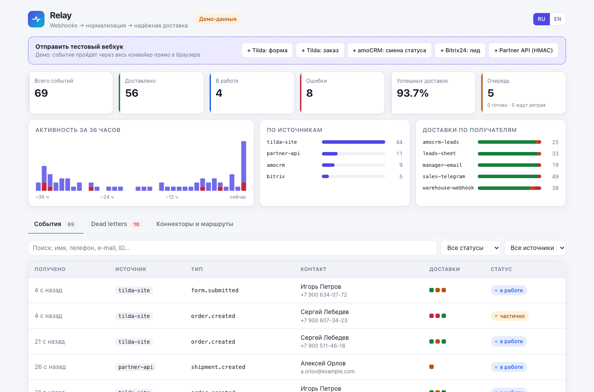

# Relay

[](https://github.com/sinnercode228/integration-hub/actions/workflows/ci.yml)

Relay receives webhooks and fans them out to destinations. A source can be Tilda, amoCRM, Bitrix24 or any system that signs its JSON with an `X-Relay-Signature` header (HMAC-SHA256); destinations are Telegram, Google Sheets, amoCRM, email over SMTP and outgoing webhooks. Each delivery runs as a separate job with its own retries, and anything that never gets through waits in dead letters, with its attempt history, until someone replays it. The backend is FastAPI and httpx, events are stored in SQLite, the queue lives in Redis or in process memory, and routes and field mapping are in one YAML file. The dashboard is React 19 and TypeScript.

This README is written as a runbook: most of it is about what Relay does when something on either side fails. Configuration and deployment come after that.

Relay is a demo project, not something built for a client. The name is made up, and every person, order and company in the fixtures and in the demo is invented. Tilda, amoCRM, Bitrix24, Telegram, Google Sheets and MoySklad are third-party services that Relay calls through their public APIs; none of them is connected to this repository.

Demo: https://sinnercode228.github.io/integration-hub/. It is the dashboard only; there is no backend on Pages. Events and failures there come from a TypeScript simulation of the pipeline that runs in the browser ([`engine.ts`](dashboard/src/api/mock/engine.ts)). Press "+ Tilda: form" on the "Send a test webhook" panel: the new event appears at the top of the list, and clicking it opens its deliveries to Telegram, Sheets and amoCRM. The dashboard re-reads the open event every 2 s, so new attempts show up on their own. The simulation fails about 30% of the deliveries created by that button, so two or three presses usually show a failure and a retry, as in the screenshot below. How the simulation differs from the backend is listed under [The demo on GitHub Pages](#the-demo-on-github-pages).


## The path of one webhook

1. `POST /webhooks/<source>` reads the body, up to `RELAY_MAX_BODY_BYTES` (1 000 000 by default) ([`api/webhooks.py`](backend/src/relay/api/webhooks.py)). The source's connector checks the secret or signature and parses the body into one or more normalized events: `type`, `external_id`, `contact`, `fields`, `raw` ([`ingest.py`](backend/src/relay/ingest.py)).
2. Each event claims an idempotency key. If the key is already taken, the event is a duplicate: the id of the first event is returned and nothing else happens.
3. Routes from [`config/relay.yaml`](config/relay.yaml) are matched. One delivery record is created per matching destination, and the event with its deliveries is written to SQLite in one transaction.
4. One job per delivery goes into the queue, and the handler answers `202`. Nothing has been sent yet. Answering at once matters: the comment in [`connectors/inbound/amocrm.py`](backend/src/relay/connectors/inbound/amocrm.py) notes that amoCRM disables a webhook after repeated slow or failed responses.
5. The worker ([`worker.py`](backend/src/relay/worker.py)) leases due jobs, renders the template for each destination, calls the connector, records the attempt, and then acks the job, schedules a retry or moves it to dead letters.

What the sender sees: `202` accepted; `200` when every event in the body was a duplicate, or for Tilda's `test=test` check (answered with plain `ok`); `401` wrong secret or signature; `404` unknown source id; `413` body over the limit; `422` body that cannot be parsed. An unexpected error during intake, such as Redis being unreachable, is a `500`.

How sources authenticate. Tilda, amoCRM and Bitrix24 send a static secret, compared with `hmac.compare_digest`. Tilda sends its API key as a form field (Relay also accepts it as a query parameter or an `X-Api-Key` header), and the key is removed from the data before the event is stored. amoCRM gets a token in the webhook URL. Bitrix24 sends `auth[application_token]`, and the token is dropped from the stored payload. Only the generic source is signed: `X-Relay-Signature: t=<unix>,v1=<hex>` over `<t>.<body>`, with a 300 s window and several `v1=` values allowed for secret rotation ([`security.py`](backend/src/relay/security.py)). `relay sign --secret <s> --file body.json` prints that header.

## When things fail

The first sections follow one lead on the `site-leads` route in [`config/relay.yaml`](config/relay.yaml), which sends every form from the site to a Telegram chat, a row in Google Sheets and a lead in amoCRM. The lead arrives while Telegram answers `429` and amoCRM is timing out. Those are three deliveries and three jobs, so a failure in one does not hold up the other two.

### Telegram answers 429

The Telegram connector reads `parameters.retry_after` from the error body and raises a retryable error that carries it ([`connectors/outbound/telegram.py`](backend/src/relay/connectors/outbound/telegram.py)). The worker schedules the next attempt at the larger of its own backoff and that hint, capped at `RELAY_BACKOFF_MAX_SECONDS` (3600). In [`test_pipeline.py`](backend/tests/test_pipeline.py), `retry_after: 40` gives a delay of 40 s instead of the base 2 s. In the dashboard the delivery shows as `retrying`, with `next_attempt_at` set and the `429` in its attempt history.

Things to know:

- Every 429 uses one of the delivery's attempts (8 by default), so a long run of 429s ends in dead letters.
- The worker has no per-destination rate limit. With `RELAY_WORKER_CONCURRENCY=4`, up to four messages can go to the same chat at the same time.
- Telegram does not follow the general HTTP rule below: only `429` and `5xx` are retried. `400` (chat not found) and `403` (bot blocked) dead-letter on the first attempt.
- Text longer than 4096 characters is cut, and the cut does not respect HTML tags or entities. Limit long fields with `truncate` in the template.

### A destination is slow or down

In the scenario, the amoCRM request times out. httpx waits up to `RELAY_HTTP_TIMEOUT_SECONDS` (10 s) for each phase of the request, and `asyncio.wait_for` cuts the whole attempt off at twice that, 20 s, unless the destination sets `timeout_seconds`. A timeout is transient, so the delivery is retried after about 2 s, then 4, 8 and so on.

The delay comes from `RetryPolicy` in [`worker.py`](backend/src/relay/worker.py): `min(3600, 2·2^(n−1))` seconds, multiplied by `1 − 0.2·random()`, so jitter only shortens a pause and never pushes it past the cap. If the destination sent `Retry-After` (seconds or an HTTP date), the delay is `max(delay, min(retry_after, 3600))`. With the default 8 attempts the pauses are about 2, 4, 8, 16, 32, 64 and 128 s, about four minutes in total. `amocrm-leads` sets `max_attempts: 12` in the config, which stretches that to about an hour.

[`connectors/http.py`](backend/src/relay/connectors/http.py) is the one place that decides what is retryable for HTTP destinations: `408`, `409`, `425`, `429`, any `5xx`, timeouts and transport errors. When the attempts run out, the delivery becomes `dead`. Once none of the event's deliveries is still pending, the event becomes `partial` if some of them got through, or `failed` if none did.

### A destination rejects the request, or the template is broken

Every other `4xx` is permanent and dead-letters on the first attempt, with the start of the response body (300 characters) as `last_error`. Connectors refine the rule where an API needs it:

| Destination | Retried | Straight to dead letters |
|---|---|---|
| Telegram | 429 (delay from `parameters.retry_after`), 5xx | every other 4xx: 400 chat not found, 403 bot blocked |
| Google Sheets | 401: with a service account the cached token is dropped and the next attempt gets a new one; with a static `access_token` the retries reuse the same token | general rule |
| amoCRM | general rule | 401 (the token is static, there is no OAuth refresh) |
| SMTP | reply codes below 500, connection errors | reply codes 500 and above, all recipients refused |

For a service account, Relay gets the Google token itself, without the Google SDK (an RS256 JWT signed with PyJWT), and keeps it cached until 60 s before it expires ([`google_sheets.py`](backend/src/relay/connectors/outbound/google_sheets.py)).

Error text is stored only after `redact` has cut the connector's secrets out of it; Telegram has the bot token in the URL. The 429 test above also checks that a Sheets token inside a `ConnectError` message does not reach `last_error`.

Templates are rendered in the worker, on every attempt. An unknown filter or a filter argument that is not a literal gives `template error: ...`, and an empty required field gives, for example, `telegram: rendered 'text' is empty` (`name` is the required field for an amoCRM lead). Both are permanent, so a typo in `relay.yaml` shows up as a dead letter, not as endless retries. Fix the YAML, restart, replay. If the route or destination that a stored delivery points at has been removed from the config, the delivery dead-letters with `... is not configured anymore`.

### The amoCRM token has expired

Creating leads: amoCRM answers `401`, and the connector treats that as final ([`connectors/outbound/amocrm.py`](backend/src/relay/connectors/outbound/amocrm.py)). Retrying with the same token cannot help, so every lead delivery dead-letters at once instead of spending an hour in backoff. The code has no OAuth refresh; `AMOCRM_ACCESS_TOKEN` is a long-lived token that you rotate yourself. The procedure: put the new token in the environment, restart (the config and the connectors are built once at startup), open the dashboard, replay the dead letters. A replay renders the lead again from the event stored at intake, so nothing is lost while the event is in the store.

Receiving webhooks from amoCRM: account webhooks are not signed, so the URL carries a token, `/webhooks/amocrm?token=...`, compared in constant time. If the token changes on the Relay side and the URL in amoCRM is not updated, every call gets `401` and a `webhook.signature_rejected` warning in the log. Because amoCRM switches off a webhook that keeps failing (step 4 above), fix this quickly and then check in the amoCRM settings that the webhook is still enabled.

### The same webhook arrives twice

CRMs and site builders resend webhooks on timeouts, so duplicates are normal traffic. [`derive_key`](backend/src/relay/idempotency.py) takes the first key available:

1. the `Idempotency-Key` header, if the sender set one;
2. the id the source system reports: `entity:id:action:last_modified` for amoCRM, `event:id:ts` for Bitrix24, `tranid` for Tilda (the order's `orderid` if there is no `tranid`), the configured `id_field` for the generic source;
3. a SHA-256 of the request body.

Because of `last_modified`, the next edit of the same amoCRM deal gets a new key and goes through as a new event. amoCRM can pack several entities into one request; each becomes a separate event, and keys from the header or the body then get `:index` appended.

With Redis the key is claimed with `SET NX EX` for seven days (`RELAY_IDEMPOTENCY_TTL_SECONDS`), and its value is the new event's id. Without Redis it is a dict in process memory with the same TTL, and it is empty after a restart. If writing the event to the store fails, the key is released, otherwise the sender's retry would also count as a duplicate. If the key expires between `SET` and `GET`, the claim is retried. A repeat with a taken key gets `200 {"accepted": [], "duplicates": ["evt_..."]}` and a `webhook.duplicate` log line; the deliveries of the first event are not touched.

The same idea is applied outbound: the webhook connector sends `Idempotency-Key: <delivery id>`, the same on every attempt, and `X-Relay-Attempt`, so a receiver can drop a retry it has already processed.

### A worker dies in the middle of a delivery

Jobs are leased, not popped. [`queue/redis.py`](backend/src/relay/queue/redis.py) keeps three keys:

```
relay:q:scheduled   ZSET  job -> earliest time it can be picked up
relay:q:inflight    ZSET  job -> lease deadline
relay:q:dead        HASH  delivery_id -> {job, reason, at}
```

I built the queue on sorted sets because a delayed retry is then a `ZADD` with a future score, and no separate delay queue is needed. Enqueuing the same job again only moves its time.

The worker picks due jobs with `ZRANGEBYSCORE` and claims each one with `MULTI { ZREM scheduled; ZADD inflight }`, with a 120 s lease (`RELAY_LEASE_SECONDS`). A worker processes a job only if its own `ZREM` removed it, so several `relay worker` processes on one Redis do not take the same job. Every worker loop starts with `requeue_expired`, which moves jobs with an expired lease from `inflight` back to `scheduled` with `ZADD NX`. The in-process queue ([`queue/memory.py`](backend/src/relay/queue/memory.py)) follows the same rules with dicts.

What that means when something crashes:

- An exception outside the connector call, such as the store being unreachable, is logged as `worker.job_crashed`, and the job stays in `inflight` until the lease runs out, then runs again. A connector that raises something other than `DeliveryError` is logged as `worker.connector_crashed` and recorded as a retryable attempt.
- If the process is killed, the Redis queue still has the job, and it runs again once the lease expires (at-least-once). With the memory queue the job is gone with the process; see the next section.
- The order of the steps matters. [`worker.py`](backend/src/relay/worker.py) saves the attempt first, then puts the retry into `scheduled`, and only then acks. If the process dies between the enqueue and the ack, the job is in both sets, and `ZADD NX` in `requeue_expired` keeps the delay that was already scheduled. With the order reversed, a job in that window would disappear from both sets.
- The cost of at-least-once: if the crash comes after the connector sent the request but before the attempt was saved, the retry sends again. See [Not handled yet](#not-handled-yet).

### Relay restarts, or Redis is unavailable

With `RELAY_QUEUE_BACKEND=redis` the queue and the idempotency keys live in Redis and survive a restart of the API or the worker. Under Docker Compose, Redis runs with `--appendonly yes`, so they also survive a Redis restart. While Redis is unreachable, `/readyz` answers `503` with `"status": "degraded"`, webhooks get `500` (claiming the idempotency key is the first Redis call), and the worker logs `worker.iteration_failed` on every poll, twice a second by default. A webhook that got a `500` was not stored, so the sender's retry after Redis is back is accepted as new.

With `RELAY_QUEUE_BACKEND=memory`, the default for `relay serve`, the queue and the idempotency keys live in the process. A restart drops every job that was waiting for its next attempt. Those deliveries stay `pending` or `retrying` in the store, and the admin API refuses to replay a delivery that is not final. This is the second item under [Not handled yet](#not-handled-yet). Use Redis for anything that runs unattended.

### Replaying a dead letter

Dead letters are deliveries with status `dead`. The dashboard lists them with the event summary and the last error; the API is `GET /admin/api/dead-letters`. To send again, use `POST /admin/api/events/{event_id}/replay` for every dead delivery of an event (`?include_delivered=true` also resends the delivered ones, which is rarely what you want) or `POST /admin/api/deliveries/{delivery_id}/replay` for one delivery. The delivery goes back to `pending`, the old attempts stay in its history, `attempt_base` records how many there were so the attempt budget starts over, `replays` goes up by one, and the job goes into the queue at once. The payload is rendered from the stored event with the current template, so a template fix applies to the replay.

## Not handled yet

The code does nothing about the following. Line numbers are as of this commit.

- **Intake is not atomic.** [`ingest.py`](backend/src/relay/ingest.py#L92) claims the idempotency key at line 92, writes the event and its deliveries at line 125, then enqueues one job per delivery at lines 129-130. The key is released only if the store write fails (lines 126-128). If `enqueue` fails, for example because Redis went away in that gap, the event is stored with deliveries that never reach the queue, and the sender's retry is answered as a duplicate. If the process dies between the claim and the store write, the Redis key points for seven days at an event that was never saved, and the sender's retries get `200` as duplicates. Tracked in [issue #1](https://github.com/sinnercode228/integration-hub/issues/1).
- **Nothing re-enqueues stuck deliveries.** Startup ([`api/app.py:36-63`](backend/src/relay/api/app.py#L36-L63)) does not look for `pending` or `retrying` deliveries that have no job, and `POST /admin/api/deliveries/{id}/replay` answers `409` for a delivery that is not final ([`api/admin.py:96-97`](backend/src/relay/api/admin.py#L96-L97)). With the memory queue, restart `relay serve` while deliveries are `retrying` and they stay that way with an empty queue. The idempotency keys are gone too, so the sender's resend is accepted as a new event, but the old deliveries stay in the store as `retrying`. Mentioned in [issue #1](https://github.com/sinnercode228/integration-hub/issues/1).
- **Double sends after a crash between send and ack.** The connector call is at [`worker.py:143`](backend/src/relay/worker.py#L143), the attempt is saved at line 187 and the job is acked at line 194. A kill in between means one more send after the lease expires; so does a response lost on the way back. Only the outbound webhook carries a stable idempotency header ([`connectors/outbound/webhook.py:55`](backend/src/relay/connectors/outbound/webhook.py#L55)); Telegram, SMTP, Google Sheets and amoCRM can get a second message, email, row or lead.
- **amoCRM: a network error on the note creates a second lead.** The lead and the note are two requests. The note request ([`connectors/outbound/amocrm.py:152-164`](backend/src/relay/connectors/outbound/amocrm.py#L152-L164)) calls `self.http.post` directly instead of `send_request`. An HTTP error there is written to `note_error` and the delivery still succeeds, which is intended, but a connection error or timeout escapes as an unexpected exception, the worker records a retryable attempt ([`worker.py:148-150`](backend/src/relay/worker.py#L148-L150)), and the retry creates the lead again. The same happens if the whole attempt runs past its 20 s timeout during the note request.
- **amoCRM lead creation has no token refresh.** [`connectors/outbound/amocrm.py:139-144`](backend/src/relay/connectors/outbound/amocrm.py#L139-L144) treats `401` as final; `AMOCRM_ACCESS_TOKEN` is rotated by hand, then a restart and a replay.
- **Google Sheets with a static `access_token` cannot recover from `401`.** The connector invalidates the token and retries ([`google_sheets.py:204-208`](backend/src/relay/connectors/outbound/google_sheets.py#L204-L208)), but `StaticTokenProvider.invalidate` does nothing (lines 50-51), so an expired token goes through all the attempts and dead-letters. `service_account_json` does not have this problem; the static token is for trying things out.
- **Delivery metrics are not exported when the worker runs separately.** Each process has its own Prometheus registry ([`metrics.py:19`](backend/src/relay/metrics.py#L19)), and `relay worker` serves no HTTP ([`cli.py:35-49`](backend/src/relay/cli.py#L35-L49)). In the Compose layout the API runs with `RELAY_RUN_WORKER=false`, so `relay_delivery_attempts_total` and `relay_delivery_duration_seconds` on its `/metrics` stay empty. Queue depth is read from Redis on every scrape and is correct.
- **Disabling a destination drops events, it does not pause them.** [`routing.py:72-75`](backend/src/relay/routing.py#L72-L75) skips disabled destinations when deliveries are planned, so events that arrive while a destination is `enabled: false` never get a delivery for it. To pause and catch up later, stop the worker instead.
- **SQLite is the only persistent store.** The docstring of [`store/sqlite.py`](backend/src/relay/store/sqlite.py#L1-L4) says single-node and means it. `docker-compose.yml` shares one volume between the API and the worker, which works on one host (WAL and `busy_timeout`, lines 68-70) and not across hosts. The `EventStore` protocol ([`store/base.py:30`](backend/src/relay/store/base.py#L30)) is there; a Postgres implementation is not.
- **Bitrix24 enrichment runs inside the webhook request.** With `rest_webhook_url` set, [`connectors/inbound/bitrix24.py:78-79`](backend/src/relay/connectors/inbound/bitrix24.py#L78-L79) calls `crm.<entity>.get`, with a 5 s timeout (line 111), before the `202` is sent. A failure is soft (`fields.enrichment = "failed"`), but routes that need the contact's phone then get nothing, and nothing enriches the event later.
- **Per-destination `timeout_seconds` is not checked against the lease.** [`config.py:51`](backend/src/relay/config.py#L51) accepts any positive value; the lease is 120 s by default ([`settings.py:35`](backend/src/relay/settings.py#L35)). With more than one worker process on the same Redis, a timeout longer than the lease lets a second worker take the job while the first attempt is still waiting on the upstream. `relay check-config` does not warn about it.
- **Open endpoints and a token in a URL.** `/metrics`, `/healthz` and `/readyz` have no auth ([`api/ops.py`](backend/src/relay/api/ops.py)); keep them off the public interface. The amoCRM inbound token is a query parameter ([`connectors/inbound/amocrm.py:71`](backend/src/relay/connectors/inbound/amocrm.py#L71); an `X-Relay-Token` header is accepted too). Relay's own request log records the route template, not the URL ([`api/app.py:85-86`](backend/src/relay/api/app.py#L85-L86)), but a reverse proxy in front of it logs the full URL unless told not to.

## Configuration

Everything about integrations is in one YAML file, [`config/relay.yaml`](config/relay.yaml) by default (`RELAY_CONFIG_PATH`). Process-level settings are `RELAY_*` environment variables ([`settings.py`](backend/src/relay/settings.py)). The file is read once at startup, so a change needs a restart. `relay check-config` parses it, fills in the environment and builds every connector's options without making network calls. It catches a missing variable, an unknown connector name or a route that points at a destination that does not exist; it does not catch a wrong `chat_id`.

```yaml
version: 1

sources:                      # POST /webhooks/<id>
  tilda-site:
    connector: tilda          # tilda | amocrm | bitrix24 | generic
    secret: ${TILDA_API_KEY}  # required unless allow_unsigned: true
    options: { key_field: api_key }

destinations:
  sales-telegram:
    connector: telegram       # telegram | google_sheets | amocrm_lead | smtp | webhook
    max_attempts: 12          # per-destination override, 1..50
    timeout_seconds: 10       # keep it well under RELAY_LEASE_SECONDS
    options:
      bot_token: ${TELEGRAM_BOT_TOKEN}
      chat_id: ${TELEGRAM_CHAT_ID}
  leads-sheet:
    connector: google_sheets
    options:
      spreadsheet_id: ${SHEETS_SPREADSHEET_ID}
      service_account_json: ${GOOGLE_SERVICE_ACCOUNT_JSON}

routes:
  - name: site-leads
    match:
      source: tilda-site            # string or list
      type: form.submitted          # string or list, glob allowed: "lead.*", "*"
      where:
        - { path: fields.utm.utm_source, op: in, value: [yandex, google] }
    deliver:
      - to: sales-telegram
        template:
          text: |-
            <b>New lead</b> {{ contact.name | default('no name') }}
            {{ contact.phone | phone }} · {{ fields.comment | default('') | truncate(300) }}
      - to: leads-sheet             # no template: the connector's default row
```

`where` conditions take an `op`: `eq`, `ne`, `in`, `not_in`, `contains`, `exists`, `regex`, `gt`, `lt`. `eq` also compares as strings, so `value: 142` matches a `"142"` that came from a form body. A route with an empty `match` takes everything from every source.

Secrets are written as `${VAR}` (startup fails and lists every missing variable) or `${VAR:-default}`. Every placeholder in the shipped `relay.yaml` has a default, so it starts with no environment at all. With `RELAY_ENV=prod`, Relay refuses to start while any source secret still starts with `dev-` ([`container.py`](backend/src/relay/container.py)).

Where the values come from depends on how Relay runs. Under Docker Compose, `.env` is passed into both containers (`env_file` in `docker-compose.yml`). For a local `relay serve`, `.env` is read only for the `RELAY_*` settings; the `${VAR}` placeholders in `relay.yaml` are filled from the process environment ([`config.py`](backend/src/relay/config.py)), so export them in the shell, for example with `set -a; . ./.env; set +a`. In both cases keep only the lines you have filled in, using [`.env.example`](.env.example) as the list of names. An empty `TILDA_API_KEY=` replaces the `dev-` default with an empty string and the source fails validation; a verbatim copy of `.env.example` fails `relay check-config` on all four sources.

### Mapping rules

I wrote a small template language instead of using Jinja; the parser is in [`templating.py`](backend/src/relay/templating.py). Templates are plain YAML values (strings, lists, maps) with `{{ expression }}` inside strings. An expression is a path, optionally followed by filters: `{{ fields.order.amount | float }}`, `{{ raw['Your comment'] | truncate(200, '...') }}`. Paths walk dicts and lists (`fields.items.0.sku`); a missing key gives `None`, not an error.

Paths you can use: `id`, `source`, `connector`, `type`, `external_id`, `received_at`, `contact.name`, `contact.phone`, `contact.email`, `fields.*` (connector-specific; for Tilda the form fields in lower case plus `form_id`, `form_name`, `utm` and `order`), `raw.*` (the source's fields as received, without secrets), and `event`, which is all of the above as one object. The outbound webhook's default template is `{{ event }}`.

There are 14 filters: `default(x)`, `phone` (to E.164; Russian `8...` and `9...` numbers become `+7...`), `lower`, `upper`, `strip`, `title`, `escape`, `date(fmt, tz)` (defaults `%d.%m.%Y %H:%M` and `Europe/Moscow`), `int`, `float`, `truncate(n, suffix)`, `join(sep)`, `json`, `replace(old, new)`. Filter arguments are parsed only with `ast.literal_eval`, so `{{ x | default(__import__('os')) }}` is a template error (`test_errors_and_no_code_execution` in [`test_core.py`](backend/tests/test_core.py)).

A string that is exactly one expression keeps the value's type: `amount: "{{ fields.order.amount | float }}"` becomes a number in the outgoing JSON, not a string.

Escaping is set per destination field. Telegram's `text` is sent with `parse_mode=HTML`, and the same applies to the SMTP `html` body: substituted values go through `html.escape`, while the template's own tags stay as they are. A contact named `Анна <b>` is sent as `Анна &lt;b&gt;`, so the chat shows the name as typed instead of switching to bold.

## Running it

### Locally, without Docker

Python 3.12 or newer. The queue and the idempotency keys stay in process memory, and SQLite goes to `data/relay.db`.

```bash
python3 -m venv .venv && . .venv/bin/activate
pip install -e "backend[dev]"
relay check-config        # validates config/relay.yaml; the shipped defaults need no environment
relay serve               # API + worker in one process on http://127.0.0.1:8000, OpenAPI at /docs
# in a second terminal, with .venv activated (the script calls relay sign):
examples/send.sh          # Tilda form and order, amoCRM, Bitrix24, signed partner JSON, then a duplicate
```

`send.sh` posts six requests to `http://127.0.0.1:8000` (`RELAY_URL` changes that). Five are accepted with `202` and create ten deliveries; the sixth repeats the Tilda form and gets `200` with the first event's id in `duplicates`. With the shipped defaults no destination has working credentials, which is enough to see every state in the dashboard without owning an account. The SMTP destination (`localhost:1025`) and the warehouse webhook (`localhost:9999`) point at local ports, so unless something listens there they go through the whole retry schedule and dead-letter after about four minutes. Telegram, Google Sheets and amoCRM get placeholder tokens, and the table above decides what their answers lead to: a `401` is retried for Google Sheets and final for amoCRM.

### Dashboard

```bash
cd dashboard && npm ci
npm run dev                       # http://localhost:5173, the same simulation as on Pages
VITE_API_MODE=live npm run dev    # the real API; /admin/api is proxied to 127.0.0.1:8000
```

To serve the built dashboard from the API itself, run `npm run build:admin`, then `RELAY_DASHBOARD_DIR=dashboard/dist relay serve` from the repository root, and open http://127.0.0.1:8000/admin/. In live mode the header has a field for `RELAY_ADMIN_TOKEN`; it is kept in `sessionStorage`. `?api=live` or `?api=mock` in the URL overrides the build-time mode.

### Docker Compose: API, separate worker, Redis

```bash
docker compose up --build      # http://localhost:8000/admin/
```

Without a `.env` the containers use the defaults from `relay.yaml`. For real credentials, see the note on `.env` under [Configuration](#configuration). The image builds the dashboard and serves it at `/admin/`. The `api` service runs with `RELAY_RUN_WORKER=false`, and `worker` runs `relay worker`; both use the Redis queue and share the SQLite file through the `relay-data` volume, so they have to run on one host. The image healthcheck calls `/healthz`; it is disabled for the worker, which serves no HTTP.

### Settings an operator touches

| Variable | Default | Notes |
|---|---|---|
| `RELAY_ENV` | `dev` | `prod`: startup fails while a source secret starts with `dev-`, and the admin API answers `503` until `RELAY_ADMIN_TOKEN` is set |
| `RELAY_ADMIN_TOKEN` | unset | Bearer token for `/admin/api`. Unset outside `prod`: the admin API is open and `admin.unprotected` is logged at startup |
| `RELAY_CONFIG_PATH` | `config/relay.yaml` | |
| `RELAY_QUEUE_BACKEND` | `memory` | `redis` for anything unattended; also moves the idempotency keys to Redis |
| `RELAY_REDIS_URL` | `redis://localhost:6379/0` | |
| `RELAY_STORE_BACKEND` / `RELAY_SQLITE_PATH` | `sqlite` / `data/relay.db` | a `memory` store exists for tests |
| `RELAY_RUN_WORKER` | `true` | `false` when a separate `relay worker` runs |
| `RELAY_WORKER_CONCURRENCY` | `4` | parallel deliveries per worker process |
| `RELAY_LEASE_SECONDS` | `120` | how long a job stays in `inflight` before another loop can take it |
| `RELAY_MAX_ATTEMPTS` | `8` | pauses of 2, 4, 8, 16, 32, 64, 128 s, minus up to 20% jitter; about four minutes in total |
| `RELAY_BACKOFF_BASE_SECONDS` / `_FACTOR` / `_MAX_SECONDS` / `_JITTER` | `2` / `2` / `3600` / `0.2` | |
| `RELAY_HTTP_TIMEOUT_SECONDS` | `10` | outbound HTTP; an attempt is capped at twice this unless the destination sets `timeout_seconds` |
| `RELAY_IDEMPOTENCY_TTL_SECONDS` | `604800` (7 days) | how long a duplicate is recognised |
| `RELAY_MAX_BODY_BYTES` | `1000000` | `413` above this |
| `RELAY_DASHBOARD_DIR` | unset | a built dashboard to serve at `/admin/`; the Docker image sets it |
| `RELAY_STOCK_CORS_ORIGINS` | empty | comma-separated allow-list for `/api/stock` |
| `RELAY_LOG_JSON` / `RELAY_LOG_LEVEL` | `true` / `INFO` | JSON lines on stderr; `false` gives a console format |

### What to watch

`GET /healthz` is liveness and always answers. `GET /readyz` pings the store and the queue and returns `503` with `"status": "degraded"` if either fails. `GET /metrics` is Prometheus text. The series worth a panel are `relay_queue_jobs{state="ready|scheduled|in_flight|dead"}`, `relay_delivery_attempts_total{destination,connector,outcome="delivered|retry|dead"}`, `relay_delivery_duration_seconds{connector}` and `relay_events_received_total{source,result="accepted|duplicate|rejected_signature|invalid_payload|ping"}`. A first alert would be `relay_queue_jobs{state="dead"} > 0`. With a separate worker process the two delivery series are not exported (see [Not handled yet](#not-handled-yet)); the worker's `delivery.attempt` log lines carry the destination, the outcome and the duration of every attempt.

Logs are structlog JSON on stderr, one object per line ([`log.py`](backend/src/relay/log.py)). Every line written while a request is handled carries `request_id`, taken from `X-Request-ID` when a proxy sets one and generated otherwise. Values under keys named `token`, `secret`, `password`, `authorization`, `api_key` or `access_token` are replaced with `***`, and connector secrets are cut out of error messages. Lines to grep for: `webhook.accepted`, `webhook.duplicate`, `webhook.signature_rejected`, `delivery.attempt` (with `outcome` and `error`), `delivery.replayed`, `worker.job_crashed`, `worker.iteration_failed`, `stock.serving_stale`.

## Stock levels from MoySklad

Separately from webhooks, `GET /api/stock?sku=A-1&sku=B-2` (or `?skus=A-1,B-2`, up to 50 SKUs) serves a stock widget on a storefront ([`connectors/moysklad.py`](backend/src/relay/connectors/moysklad.py), [`api/stock.py`](backend/src/relay/api/stock.py)). The MoySklad token stays on the server; the browser gets `sku`, `available` and `status` (`in_stock`, `low`, `out_of_stock`) for each item, a `stale` flag, and a CORS header for origins listed in `RELAY_STOCK_CORS_ORIGINS`. Results are cached for 60 s. Concurrent misses wait on one `asyncio.Lock` and check the cache again after it, so a burst of requests from a product page turns into one request to MoySklad's `/entity/assortment`; SKUs go into its filter in batches of 25. If MoySklad fails, values up to 900 s old are served with `stale: true` and `Cache-Control: public, max-age=0`, and `stock.serving_stale` is logged. If any requested SKU has no value that recent, the answer is `503`.

## The demo on GitHub Pages

[`.github/workflows/pages.yml`](.github/workflows/pages.yml) builds the dashboard with `VITE_API_MODE=mock` and `BASE_PATH=/<repo>/` and deploys it with `actions/deploy-pages`; the Pages source has to be set to GitHub Actions. In mock mode [`engine.ts`](dashboard/src/api/mock/engine.ts) stands in for the HTTP client. It seeds a history of events, and the "Send a test webhook" buttons run routing, the 2 to 128 s retry schedule, `Retry-After` hints, dead letters and replay in the browser, with a seeded PRNG (mulberry32) so reloads look alike. It is a simulation of the backend's rules, not the backend: the outcome of each delivery is decided up front, pauses have no jitter, a replay always succeeds, and `in_flight` is always 0.



More screenshots: [dead letters](docs/screenshots/dead-letters.png), [connectors and routes](docs/screenshots/connectors.png), [phone, dark theme](docs/screenshots/mobile.png).

## Development

```bash
cd backend && pytest --cov=relay                 # 140 tests, 92% coverage (coverage.py, branch = true)
ruff check src tests && ruff format --check src tests && mypy   # mypy in --strict mode
cd ../dashboard && npm run lint && npm test      # ESLint + tsc, 15 Vitest tests
```

The tests need no network (respx) and no Docker (fakeredis, SQLite in a temporary directory). The queue and the idempotency store run the same contract tests against the in-memory and the Redis implementation, and the event store against memory and SQLite, through parametrized fixtures ([`tests/test_infra.py`](backend/tests/test_infra.py)). The worker and ingest tests use an injected clock, so backoff is tested by advancing time, not by sleeping. CI ([`.github/workflows/ci.yml`](.github/workflows/ci.yml)) runs ruff, mypy and the tests on Python 3.12, 3.13 and 3.14, validates `config/relay.yaml`, runs the dashboard lint and tests, builds the dashboard and builds the Docker image.

Adding a connector is one class with `@inbound` or `@outbound` ([`connectors/base.py`](backend/src/relay/connectors/base.py)) plus an import in `connectors/inbound/__init__.py` or `connectors/outbound/__init__.py`. The pipeline, retries, metrics and the admin API's connector list pick it up from the registry.

---

Built by Грешный Котик (sinnercode). I take freelance work like this: Telegram [@sinnercode](https://t.me/sinnercode). License: [MIT](LICENSE).

Relay принимает вебхуки (Tilda, amoCRM, Bitrix24, любой JSON с HMAC-подписью), сохраняет события в SQLite и доставляет их воркером в Telegram, Google Sheets, amoCRM, на почту и во внешние вебхуки. Временные ошибки повторяются с экспоненциальной задержкой, постоянные сразу уходят в dead letters, откуда их можно отправить заново из дашборда. Это демо-проект, а не работа для клиента: все люди и заказы в данных придуманы. Запуск: `pip install -e "backend[dev]" && relay serve` или `docker compose up --build`; что код пока не обрабатывает, перечислено в разделе «Not handled yet».
